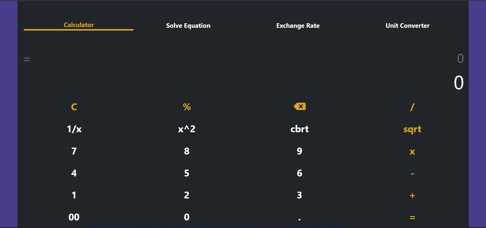
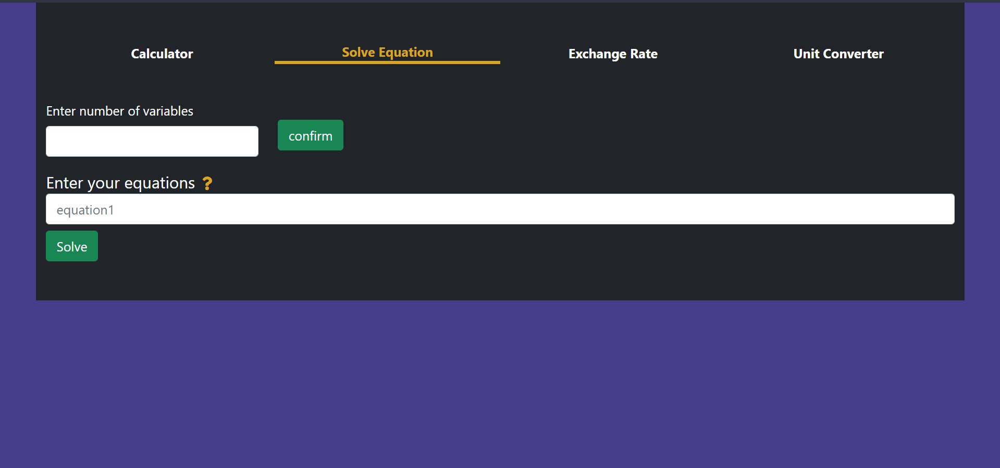
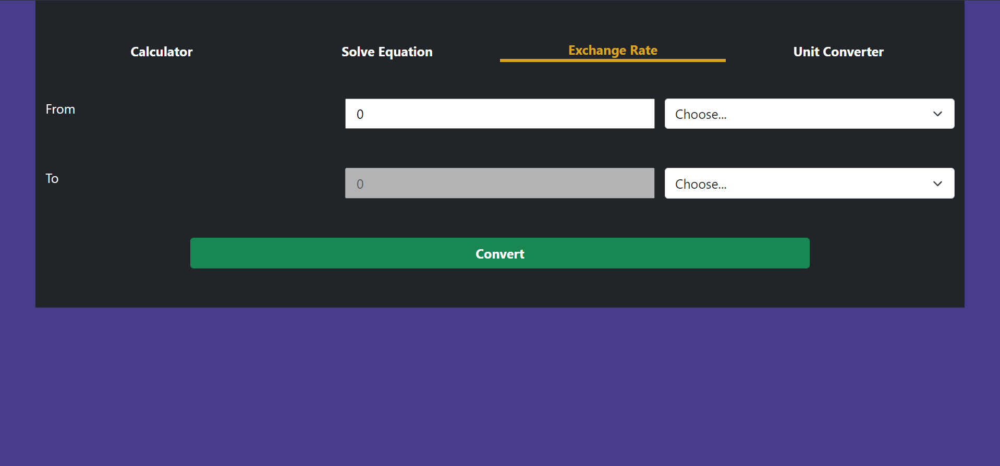

# Calculator App
This is a basic project made using html, css, js and bootstrap.

### visit website
[click here](https://rishikesh-kumar-7258.github.io/calculator/)

### Screenshots

### Functions
* Simple calculation
* Equation solving
* Currency converting;
* Unit converting

### Design credit
[Yukta-Watti](https://github.com/Yukta-Watti)